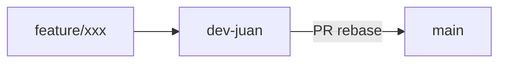

# Zona 2 Coffee Recovery - Punto de Venta

Sistema de punto de venta tipo CRM para cafetería desarrollado con React, Vite y arquitectura limpia.

## 🚀 Características

- **Arquitectura Limpia**: Separación de responsabilidades en capas (domain, application, infrastructure, presentation)
- **Diseño Minimalista y Moderno**: Interfaz limpia siguiendo principios de usabilidad de Jakob Nielsen
- **Responsive**: Optimizado para laptop, tablet e iPad
- **Paleta de Colores**: Verdes, matcha, negros y cafés
- **Módulos Completos**:
  - Dashboard con estadísticas
  - Punto de Venta con carrito
  - Gestión de Productos
  - Control de Inventario
  - Base de Clientes
  - Gestión de Pedidos
  - Reportes y Análisis
  - Configuración del Sistema

## Ecosistema de repos

| Repo | Responsabilidad |
|------|-----------------|
| `punto-venta-cafeteria` (este) | Frontend POS (React + Vite) |
| `punto-venta-cafeteria-BackEnd` | API FastAPI + MySQL |
| `Pagina-web-zona2coffe` | Sitio web público |

## Cómo trabajar cambios

Historial **lineal** (estilo fast-forward / rebase). No se hace push directo a `main`.



1. Clonar y usar la rama de trabajo:
   ```bash
   git clone https://github.com/prometeosystem/punto-venta-cafeteria.git
   cd punto-venta-cafeteria
   git checkout dev-juan
   git pull --ff-only origin dev-juan
   ```
2. Crear una rama de feature desde `dev-juan`:
   ```bash
   git checkout -b feature/nombre-corto
   ```
3. Hacer commits pequeños y claros (evitar secretos: `.env`, tokens, contraseñas).
4. Antes de subir, actualizar con fast-forward only:
   ```bash
   git fetch origin
   git pull --ff-only origin dev-juan
   ```
5. Push de la feature y abrir PR hacia `dev-juan` (o integrar en `dev-juan` y luego PR `dev-juan` → `main`).
6. Esperar CI verde (GitHub Actions).
7. Merge con **Rebase and merge** (historial lineal). No usar merge commit clásico.
8. Si `main` avanzó, rebasear antes del PR:
   ```bash
   git fetch origin
   git rebase origin/main
   ```
9. Nunca: `git push --force` a `main`, ni commits de `node_modules/`, `.env` o credenciales.

Configuración local recomendada (solo en este repo):

```bash
git config pull.ff only
```

## 📋 Requisitos Previos

- Node.js 20+ (recomendado; CI usa Node 20)
- npm o yarn

## 🛠️ Instalación

1. Instala las dependencias:
```bash
npm install
```

2. Inicia el servidor de desarrollo:
```bash
npm run dev
```

3. Abre tu navegador en `http://localhost:5173`

## 📁 Estructura del Proyecto

```
src/
├── domain/           # Entidades y lógica de negocio
├── application/      # Casos de uso y servicios
├── infrastructure/   # Implementaciones técnicas (API, storage, etc.)
└── presentation/     # Componentes React, páginas, routing
    ├── components/   # Componentes reutilizables
    ├── pages/        # Páginas principales
    ├── layouts/      # Layouts de la aplicación
    ├── router/       # Configuración de rutas
    ├── context/      # Contextos de React
    └── styles/       # Estilos globales
```

## 🎨 Principios de Usabilidad Aplicados

1. **Visibilidad del estado del sistema**: Feedback constante al usuario
2. **Correspondencia entre sistema y mundo real**: Lenguaje familiar
3. **Control y libertad del usuario**: Navegación intuitiva
4. **Consistencia y estándares**: Diseño uniforme en toda la aplicación
5. **Prevención de errores**: Validaciones y confirmaciones
6. **Reconocimiento en lugar de recuerdo**: Iconos y etiquetas claras
7. **Flexibilidad y eficiencia de uso**: Atajos y personalización
8. **Diseño estético y minimalista**: Interfaz limpia
9. **Ayuda a reconocer, diagnosticar y recuperarse de errores**: Mensajes claros
10. **Ayuda y documentación**: Tooltips y ayuda contextual

## 🎯 Tecnologías Utilizadas

- **React 18**: Biblioteca de UI
- **Vite**: Build tool y dev server
- **React Router**: Navegación
- **Tailwind CSS**: Estilos utilitarios
- **Lucide React**: Iconos
- **ESLint**: Linter de código

## 📱 Responsive Design

El sistema está optimizado para:
- **Laptop**: Layout completo con sidebar visible
- **Tablet**: Sidebar colapsable, diseño adaptativo
- **iPad**: Interfaz táctil optimizada

## 🚧 Próximos Pasos

- Integración con backend API
- Autenticación y autorización
- Gráficos con librería de visualización
- Impresión de tickets
- Notificaciones en tiempo real
- Modo offline

## 📄 Licencia

Este proyecto es privado y propiedad de Zona 2 Coffee Recovery.


